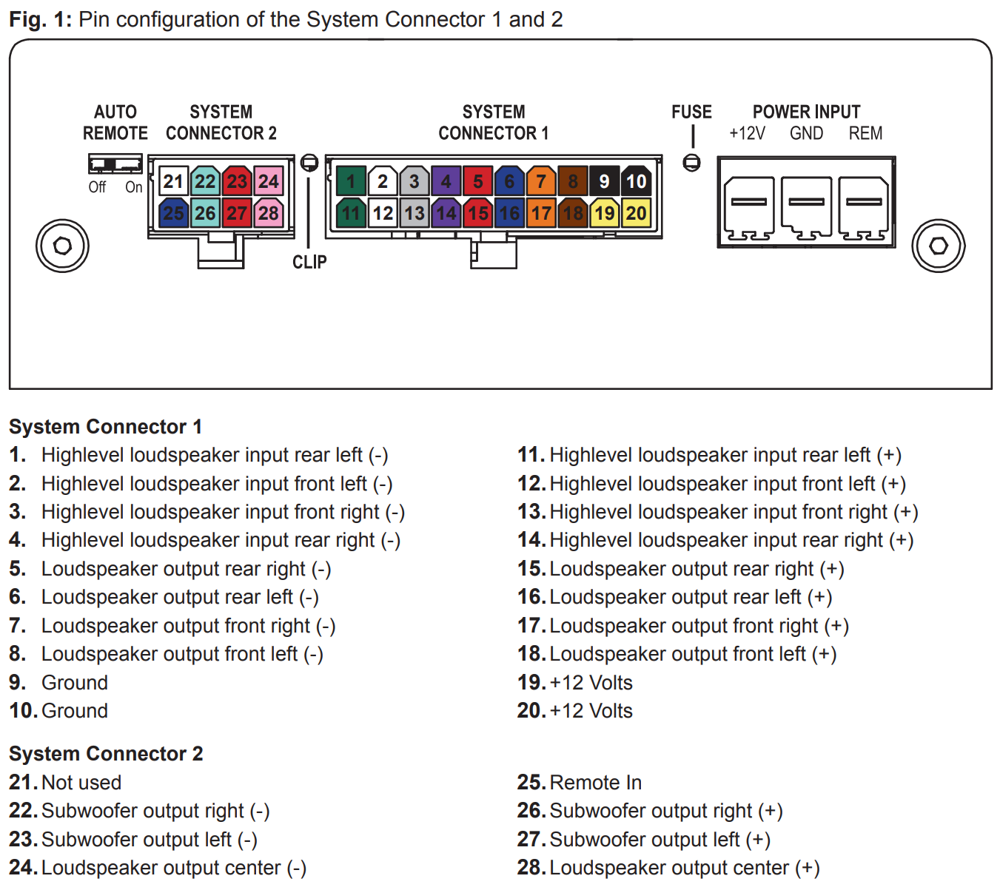

# MATCH UP 7BMW

## Automatic Time Measurement – ATM

https://www.audiotec-fischer.de/en/knowledge-base/DSP-PC-Tool/atm/

정확한 스테이지 이미지를 위해 타이밍 조정이 필요함.

각 스피커와 운전자간 거리 실측(Tape measure)을 통한 방법도 유효하나, 미세조정이 필요하고 오차가 발생할 수 있음. 특히, Passive 2-Way 시스템의 경우 더욱 측정과 조정이 어려울 수 있음.

ATM은 이런 복잡하고 어려운 타이밍 설정을 자동화해 주는 DSP PC-Tool의 기능임.

### 준비사항

ATM 을 실행하기 전 아래 사항들에 대한 준비가 필요함. 만약, [Audiotec-Fischer](https://www.audiotec-fischer.de)에서 제공하는 [셋업파일](https://www.audiotec-fischer.de/en/matchdatabase/soundIndex)을 적용했다면 특별히 변경할 것은 없고, 측정 마이크의 위치만 정확히 준비.

[ IO Menu ]

- 출력채널 이름 확인 (eg. Front L Full)

- 미사용 채널은 'Not Used'로 설정할 것!

- 미드레인지와 트위터는 High pass filter를 설정할 것!

- 측정 마이크의 위치는 운전자 머리 중앙에 위치하도록 설치. (아래 그림과 같은 위치)

  

### 테스트 음원

{DSP PC-Tool 설치 디렉토리}/soundFiles/ATM - Automatic Time Measurement/timeMeasurementClick.mp3파일(또는 timeMeasurementClick.wav 파일)을 USB Stick에 복사하여 준비. 

> 위의 디렉토리는 DSP PC-Tool 실행 후 우측 메뉴 중 "Test Tones" 를 통해서도 접근 가능.

### Input 설정 (Source of the test signals)

 광케이블이나 별도의 Extension Card(HEC)를 통한 재생이 아닌 일반적인 경우 Analog(Line- or **Highlevel Input**) 로 설정. (Default : Analog)

> 참고 : Head-unit to DSP Pin config. (System connector 1의 1-4, 11-14 : **Highlevel loudspeaker input**)

### 레퍼런스 스피커

ATM은 레퍼런스 스피커와 다른 스피커간의 차이(Time delay)를 이용하여 자동 측정하는 방식이며, 이를 위해 하나의 레퍼런스 스피커(측정의 기준이 되는 스피커)를 지정해주어야 함.

Front Left 를 레퍼런스 스피커로 설정 (좌핸들인 경우 자동 선택)

### 측정 모드 설정

Distance Mode 를 선택하고, 레퍼런스 스피커와 마이크사이의 거리를 측정하여 기입

> 위의 모든 설정을 마친상태의 화면은 아래 **측정** 부분 첫 번째 그림 참조.

### 측정

테스트 음원을 실행하고, ATM 창의 Audio Input 바가 **Good** 위치(Bar의 색상이 녹색으로 표시되도록)에 오도록 차량의 볼륨을 설정.

모든 준비를 마친 후 하단의 **Start** 버튼을 클릭하여 측정 시작.

측정이 시작되면 레퍼런스 스피커와 다른 스피커로 번갈아 테스트 신호를 재생하며 차이를 자동측정함.

측정이 완료되면 아래와 같은 화면이 표시되고, **After ATM** 버튼과 **Before ATM** 버튼을 이용하여 ATM 적용 전/후의 차이를 비교해볼 수 있음.

**Save selected data and close ATM** 버튼을 클릭하여 설정을 저장하고 ATM화면을 닫고나면 아래와 같이 적용된 데이터(오렌지색 박스부분)를 볼 수 있음.

