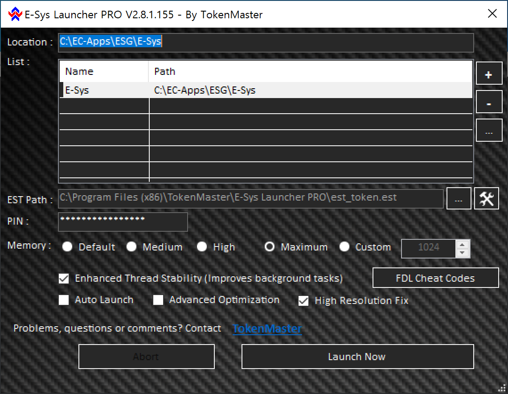
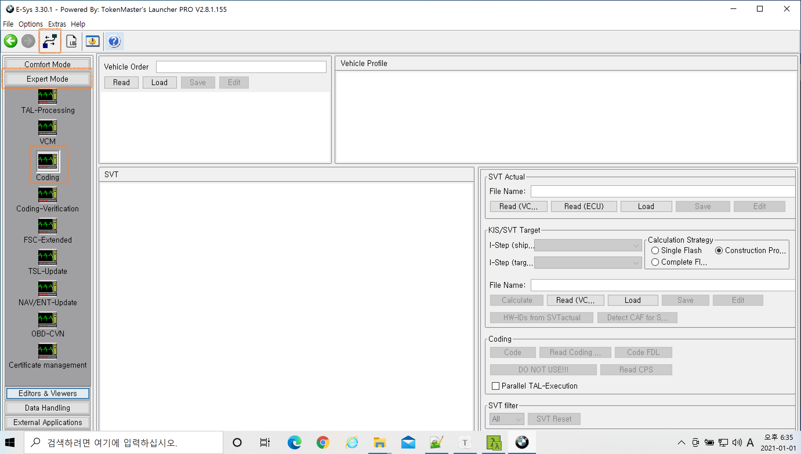

# Coding

## Installation

- **E-Sys Launcher PRO V2.8.1.155** ( /w TokenBuster)
- E-Sys 3.28.1,  **E-Sys 3.30.1**
- PSDZ Data Lite V4.22.41 , **PSDZ Data Lite V4.27.11**
- 접속코드 : **S15A**
- Firmware version : S15A-18-07-521 , **S15A-20-11-542**

## Execution (작성 중)

### E-Sys Launcher  PRO 실행

관리자 권한으로 실행 후 아래와 같이 설정

- Location : E-Sys 설치 디렉토리
- List : 설치된 E-Sys 를 추가(+)
- EST Path : est_token.est 의 경로를 지정
- PIN
- Memory : 가능하면 크게...
- FDL Cheat Codes : 사용할 Cheat code를 선택 ( 경로는 {E-Sys Launcher PRO 설치 디렉토리}/FDLCodes )
- High Resolution Fix : 고해상도 디스플레이에서 글자가 겹쳐지는 현상 방지

위와 같이 설정 후 **Launch Now** 버튼을 클릭하여 E-Sys 실행.

메인화면 좌측 메뉴에서 Export Mode > Coding 선택 후 상단 연결아이콘 클릭

## 재난안전문자 비활성화

head unit -> expert mode -> 3002 audio_tuner_traffic -> ews_korea -> nicht-aktiv
